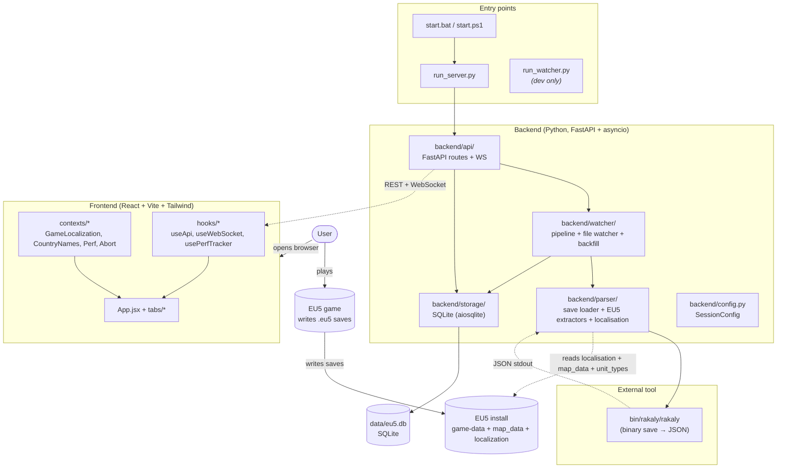
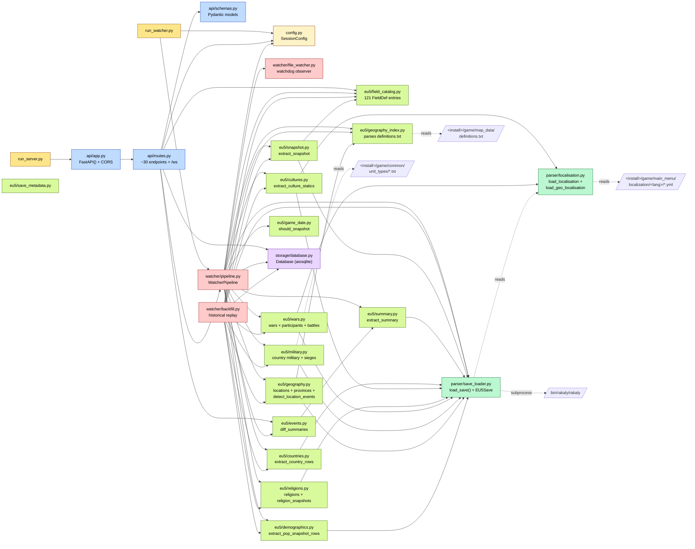
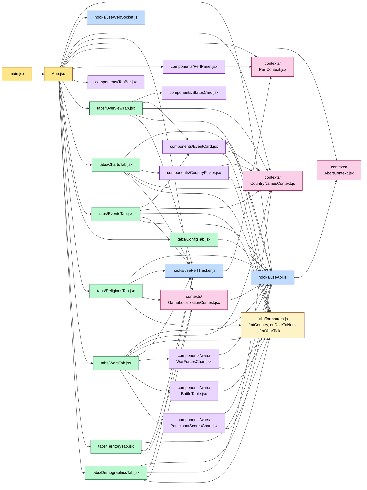
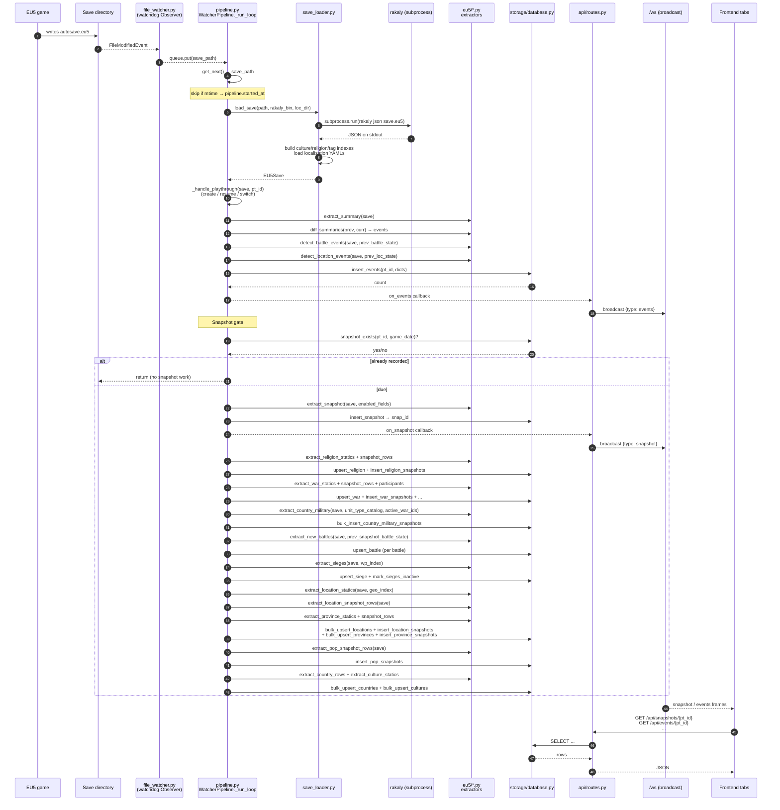
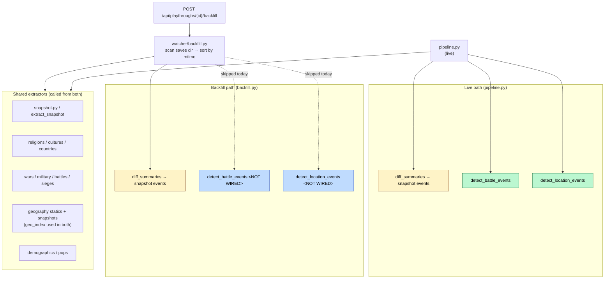
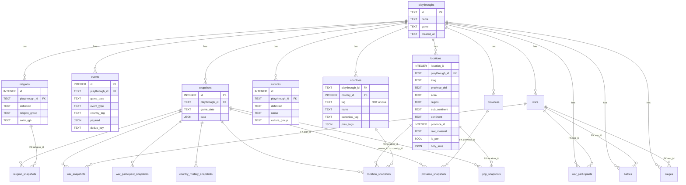
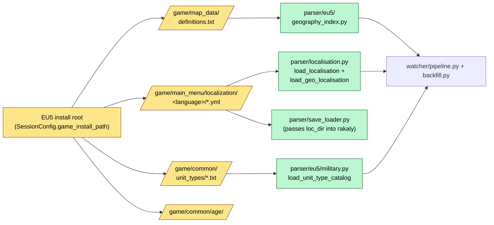
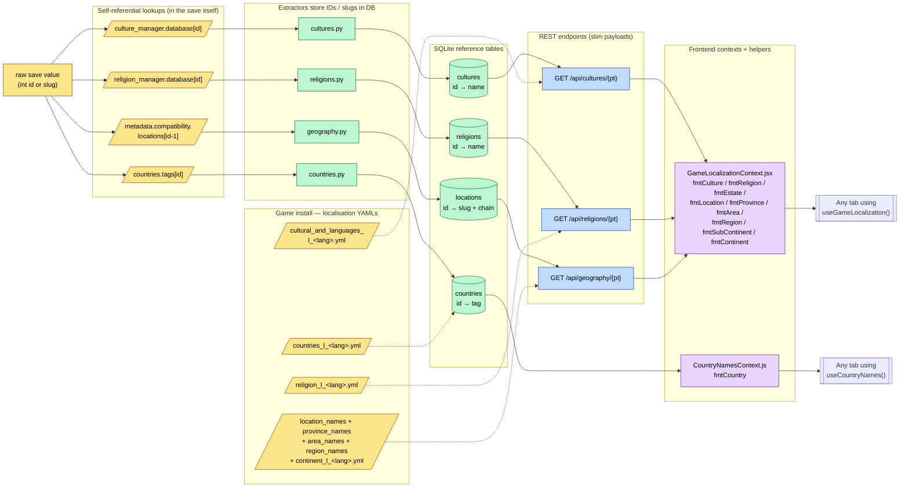

# PDX Save Analyzer — Application Map

> **Purpose.** This document is the architecture reference for PDX Save Analyzer. It is **file-level** by design — every node corresponds to a real file in the repository — so it can be used as a debugging map: when something misbehaves, find the file in a diagram, follow the arrows to its callers and callees, and you have the blast radius.
>
> **Maintenance rule (project rule #2).** Every change to the file layout, dependency edges, API surface, DB schema, or runtime flow must be reflected here in the same change. If a diagram and the code disagree, the code is right and this doc is a bug. Do not let it drift.
>
> **Scope.** Game-agnostic where possible; EU5-specific where the implementation only covers EU5 today (the entire `backend/parser/eu5/` subtree).
>
> **How to read the diagrams.** Boxes are files. Solid arrows are static `import` edges (`A → B` means *A imports B*). Dashed arrows are runtime data flow or function calls across an async / IPC boundary. Subgraph boxes are folders. Where a folder contains too many files to be useful inline, the inline diagram shows folder-level nodes and a dedicated zoom-in section follows.

---

## 1. High-Level Layers

The `entry → backend` and `backend → db` edges are strict; the `backend → frontend` edges happen over the network (REST + a single WebSocket on `/ws`). The frontend never reads the SQLite file directly.

---

## 2. Backend — File-Level Module Dependencies

This is the single most useful diagram for backend debugging. Every backend `.py` file is a node; every `from backend.X import Y` is an edge.

Notable things to read off this graph:

- `pipeline.py` and `backfill.py` are the **two** orchestrators. Every EU5 extractor is called from one or both — if a parser bug only shows up live-but-not-on-backfill (or vice-versa) the missing edge in this graph is your first suspect.
- `save_loader.py` is the only file that touches the rakaly subprocess. If saves stop loading, look there first.
- `geo_index.py`, the localisation loader, and the unit-type loader are the only files that touch the user's game install. They are the entire surface area for project rule #5 ("never ship proprietary game files").
- `field_catalog.py` is imported by `pipeline`, `backfill`, `snapshot`, **and** the API (so the frontend can render the field picker). It is the source of truth for which fields are tracked.
- `api/routes.py` and `pipeline.py` are the two largest files and the two highest-fan-in nodes — almost any change is likely to touch one of them.

---

## 3. Frontend — File-Level Module Dependencies

Things to read off this graph:

- `useApi.js` is the **only** file that calls `fetch`. Any new endpoint adds a method here. It hooks into `AbortContext` so any tab can cancel an in-flight request when the user switches away.
- `GameLocalizationContext` is the single source of truth for ID-to-name resolution (cultures, religions, estates, locations, areas, regions, sub-continents, continents, provinces). Any new "I see a raw ID in the UI" bug starts here.
- `CountryNamesContext` is older / simpler — country tag → display name only — and predates `GameLocalizationContext`. The two should probably merge eventually.
- `usePerfTracker` is opt-in; tabs that have it route their fetch durations into `PerfContext`, which `PerfPanel` reads.

---

## 4. Runtime — Live Save Ingest (the hot path)

This is **the** debugging diagram. When a save lands and "the UI didn't update", trace through here.

Common failure patterns and where to look in this diagram:

| Symptom | First place to look |
|---|---|
| "Saves not detected" | Steps 1–3: `file_watcher.py`, save extension list in `SessionConfig.save_extensions()`, `_started_at` mtime gate |
| "Save detected but parse fails" | Step 4–6: `save_loader.py`, rakaly binary path, raw JSON shape |
| "Snapshot skipped" | Snapshot gate alt-block: `snapshot_exists` and `should_snapshot` (frequency = `yearly`/`5years`/etc.) |
| "Tab shows raw IDs instead of names" | Frontend → `GameLocalizationContext`, then back to whichever extractor populates the relevant table |
| "Live works, backfill doesn't" (or vice-versa) | Compare which extractors `pipeline.py` calls vs. which `backfill.py` calls — see §5 |
| "WS connected but UI never updates" | `on_snapshot`/`on_events` callbacks → `_broadcast` in `routes.py` → `useWebSocket.js` reducer in `App.jsx` |

---

## 5. Runtime — Historical Backfill

Same extractors as live, **but** entered from the API as a one-shot job over the user's existing save folder. The crucial difference is the set of `detect_*` functions that the live path runs but the backfill path does **not**.

The two `<NOT WIRED>` boxes are tracked in `docs/games/eu5/save-schema.md` under the **Geography** backlog as `[PARTIAL] Geography events in backfill` and `[PARTIAL] Battle sub-events in backfill`. This diagram is the visual version of that ticket — when it's resolved, both dashed edges become solid and the `[PARTIAL]`s become `[DONE]`.

---

## 6. REST API Surface

Every endpoint exposed by `backend/api/routes.py`, the DB tables it reads/writes, and the frontend file that consumes it. Use this when you want to know "if I change endpoint X, what breaks?".

| Method | Path | Tables touched | Frontend caller |
|---|---|---|---|
| `POST` | `/api/start` | `playthroughs` (via pipeline init) | `ConfigTab.jsx` |
| `POST` | `/api/stop` | — | `ConfigTab.jsx` |
| `GET` | `/api/status` | — (in-memory pipeline state) | `App.jsx`, `ConfigTab.jsx` |
| `GET` | `/api/config` | — (file: `data/session_config.json`) | `ConfigTab.jsx` |
| `POST` | `/api/config` | — (file) | `ConfigTab.jsx` |
| `POST` | `/api/load-playthrough` | `playthroughs` | `ConfigTab.jsx` |
| `GET` | `/api/scan-saves` | — (file system) | `ConfigTab.jsx` |
| `POST` | `/api/playthroughs/{id}/backfill` | all tables (replays into DB) | `ConfigTab.jsx` |
| `GET` | `/api/playthroughs` | `playthroughs` | `App.jsx` |
| `GET` | `/api/snapshots/{id}` | `snapshots` | `ChartsTab.jsx`, `App.jsx` |
| `GET` | `/api/events/{id}` | `events` | `EventsTab.jsx`, `OverviewTab.jsx`, `EventCard.jsx` |
| `GET` | `/api/events/{id}/country-tags` | `events` | `EventsTab.jsx` |
| `GET` | `/api/fields` | — (`field_catalog.py`) | `ConfigTab.jsx` |
| `GET` | `/api/religions/{id}` | `religions` | `GameLocalizationContext`, `ReligionsTab.jsx` |
| `GET` | `/api/religions/{id}/snapshots` | `religion_snapshots` | `ReligionsTab.jsx` |
| `GET` | `/api/cultures/{id}` | `cultures` | `GameLocalizationContext`, `DemographicsTab.jsx` |
| `GET` | `/api/geography/{id}` | `locations` (slugs) + game-data YAMLs | `GameLocalizationContext` |
| `GET` | `/api/wars/{id}` | `wars` | `WarsTab.jsx` |
| `GET` | `/api/wars/{id}/snapshots` | `war_snapshots` | `WarsTab.jsx` → `WarForcesChart.jsx` |
| `GET` | `/api/wars/{id}/participants` | `war_participants` | `WarsTab.jsx` |
| `GET` | `/api/wars/{id}/participant-history` | `war_participant_snapshots` | `WarsTab.jsx` → `ParticipantScoresChart.jsx` |
| `GET` | `/api/battles/{id}` | `battles` | `WarsTab.jsx` → `BattleTable.jsx` |
| `GET` | `/api/sieges/{id}` | `sieges` | `WarsTab.jsx` |
| `GET` | `/api/military/{id}` | `country_military_snapshots` | `WarsTab.jsx` |
| `GET` | `/api/locations/{id}` | `locations` | `TerritoryTab.jsx` |
| `GET` | `/api/locations/{id}/snapshots` | `location_snapshots` **LEFT JOIN** `locations`, `countries` | `TerritoryTab.jsx` |
| `GET` | `/api/provinces/{id}` | `provinces` | *(not yet wired in UI)* |
| `GET` | `/api/provinces/{id}/snapshots` | `province_snapshots` | *(not yet wired in UI)* |
| `GET` | `/api/pops/{id}/snapshots` | `pop_snapshots` | `DemographicsTab.jsx` |
| `GET` | `/api/pops/{id}/aggregates` | `pop_snapshots` (grouped) | `DemographicsTab.jsx` |
| `GET` | `/api/pops/{id}/country-owners` | `pop_snapshots` | `DemographicsTab.jsx` |
| `GET` | `/api/countries/{id}` | `countries` | `DemographicsTab.jsx` |
| `WS` | `/ws` | — (broadcast only) | `useWebSocket.js` |

> When this table drifts, the test is mechanical: `grep -nE "@router\\.(get|post|websocket)" backend/api/routes.py` and `grep -nE "get\\(.*api/" frontend/src/hooks/useApi.js` should each give exactly the rows above.

---

## 7. WebSocket Message Types

The `/ws` endpoint is one-directional (server → client) and broadcasts to every connected client. There are four message types, all wrapped in a `WsMessage{type, data}` envelope.

| `type` | Producer | `data` shape | Frontend consumer |
|---|---|---|---|
| `status` | `broadcast_status()` after `/api/start`, `/api/stop` | `StatusResponse` | `App.jsx` (sets pipeline state) |
| `snapshot` | `pipeline._on_snapshot` callback | snapshot dict | `App.jsx` (triggers tabs to refetch) |
| `events` | `pipeline._on_events` callback | list of event dicts | `App.jsx` → `EventsTab` / `OverviewTab` |
| `backfill_progress` | `backfill.py` job loop | `{stage, current, total, ...}` | `ConfigTab.jsx` progress bar |

---

## 8. SQLite Schema

Every table in `backend/storage/database.py`, grouped by domain. All snapshot tables FK to `snapshots(id)`; everything FKs to `playthroughs(id)`. The composite primary keys on entity tables (`cultures`, `religions`, `wars`, etc.) are `(playthrough_id, id)` so two playthroughs can share the same in-game ID without colliding.

(Snapshot tables and per-pop / military tables are omitted from the ER fields list to keep the diagram readable — see `database.py` for the full column list. The full per-table field catalog lives in `docs/games/eu5/save-schema.md`.)

> **Note — `countries.tag` is not unique per playthrough.** Multiple country objects can share a TAG in the same save (formables co-existing with their pre-existing slot, horde civil-war pretenders, etc.). The sole unique handle is `country_id`, and all foreign-key-style joins (e.g. `location_snapshots.owner_id → countries.country_id`) go through it — never through `tag`. See [`docs/games/eu5/duplicate-tags.md`](./games/eu5/duplicate-tags.md) for the empirical finding and decision trail.

---

## 9. Game-Data Read Surface (project rule #5)

These are the **only** places in the codebase that touch the user's game install. Anything new that needs to read from `<install>/...` belongs in one of these modules — never in a tab, never in storage, never committed as a static asset.

The `age/` directory is listed as known-but-not-yet-parsed in `docs/games/eu5/OVERVIEW.md`; when it's wired, a new node belongs on this diagram. Anything not on this diagram is forbidden from reading game files.

---

## 10. Localisation Resolution Chain

How a raw integer or slug in the save becomes a display string in the UI. This is the chain to walk when "the UI shows a number / a slug instead of a name".

Two things to internalise from this diagram:

1. **The save is self-referential for IDs.** Cultures, religions, country tags, and now location slugs are all resolvable from data inside the save itself — `parser/save_loader.py` builds the `culture_index`, `religion_index`, `tag_index` once per parse, and the location slug array is read directly from `metadata.compatibility.locations`. Game files are only needed for the human-readable display string layered on top.
2. **Geography is the only level that needs an external file for the *structural* hierarchy itself**, not just for display strings: `definitions.txt` is what tells us province → area → region → sub_continent → continent. That's why `geography_index.py` exists at all and why it sits in the same trust boundary as the localisation YAMLs.

---

## Maintaining this document

When you change something, here's the checklist:

1. **New backend file** → add a node in §2 and at least one import edge.
2. **New frontend file** → add a node in §3 and the import edges.
3. **New API route** → add a row in §6 and (if applicable) a new WS message in §7.
4. **New DB table or column on a snapshot table** → update §8 and the matching field catalog row in `docs/games/eu5/save-schema.md`.
5. **New file read from the game install** → add a node in §9 (and confirm it's the only place that does it).
6. **New entity type in the save resolved to a display name** → add it to the chain in §10.
7. **New `extract_*` or `detect_*` function** → add it to the live-path sequence in §4 and either to §5's "shared" or to the live-only column.

Per project rule #2, these updates are part of the same change as the code, not a follow-up.
